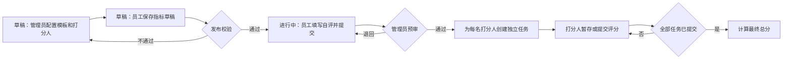

# 衡标员工考核系统：当前业务需求基线

**状态：** 根据当前仓库实现反推，作为现阶段业务验收基线。

**更新时间：** 2026-09-21
**适用范围：** 企业、子公司及其在职员工的周期性指标考核。

## 1. 业务目标与边界

系统用于完成一次全员考核的配置、指标确认、预审、多人独立评分和结果导出。业务流程以“全员统一周期”为边界：超级管理员创建周期，管理员完成本授权范围内的人员配置，员工在草稿期完善自己的指标，发布后进行自评和预审，预审通过后由指定打分人评分。

周期的开始时间和结束时间仅作记录与展示，不自动开关流程，也不限制填报、审核或评分。

本期不包含附件/佐证材料、外部消息推送、评分权重、强制分布、申诉、周期自动归档和跨企业人员调动的历史考核处理。

## 2. 角色与数据范围

同一员工可以同时具备员工、管理员、打分人和超级管理员身份。

| 角色 | 可做事项 | 数据范围 |
| --- | --- | --- |
| 超级管理员 | 管理企业、子公司、全员周期和管理员授权；发布或停止周期；查看及导出全部结果和评分明细。 | 全部企业。 |
| 子公司管理员 | 维护员工；创建、编辑模板；为员工匹配模板、配置打分人；审核或退回员工提交；查看进度并导出最终分。 | 被授权的子公司；模板按所属企业使用。 |
| 员工 | 草稿期维护自己的指标草稿；发布后填写自评内容、提交预审、查看逐项退回意见。 | 仅本人考核单。 |
| 打分人 | 对分配给自己的、已通过预审的考核单暂存或提交评分。 | 仅本人评分任务。 |

管理员不能读取评分细项、单个打分人的得分或评语；超级管理员可以。管理员可同时是打分人，但只能通过“打分人”身份查看自己的任务。

## 3. 组织、人员与账号

- 组织分为企业和子公司两层；子公司名称在全系统内按忽略大小写、去首尾空格后不得重名。
- 员工以工号为唯一标识，必须归属一个子公司，并保存姓名、部门、职位、手机号和在职状态。
- 管理员授权以子公司为单位；一个管理员可管理多个子公司。
- 只有在职员工能登录、被配置到周期、担任打分人或被打分。
- 员工可在同一企业内调动子公司。若跨企业调动且该员工已有任意考核记录，系统拒绝调动；跨企业历史/在途考核如何处理不在本期范围内。
- 密码由员工自行修改，修改后系统撤销该员工全部既有会话并重新登录当前会话。
- 删除企业、子公司、员工或周期属于永久敏感删除，必须输入确认语；删除会连带清理相关配置与业务数据，不能恢复。

## 4. 考核周期与状态

一个周期有三种状态：

| 状态 | 业务含义 | 可做事项 |
| --- | --- | --- |
| `DRAFT`（草稿） | 配置阶段，也是员工保存指标草稿的阶段。 | 配置/重配模板、打分人和指标；员工修改自己的指标树；超级管理员编辑、发布或停止周期。 |
| `ACTIVE`（进行中） | 已发布的执行阶段。 | 指标结构冻结；员工填写自评并提交；管理员审核；打分人评分；超级管理员可停止周期。 |
| `STOPPED`（已停止） | 历史锁定阶段。 | 不再允许填报、审核或评分；只读及导出。 |

发布周期时，系统对**所有在职员工**统一校验：每人必须已有考核单、至少一名有效打分人，并有一棵完整且合法的指标树。任一员工不满足条件，发布失败并返回最多十名问题员工及原因。

## 5. 模板、指标草稿与发布校验

### 5.1 模板

- 模板属于一个企业，是该企业的私有资产；仅超级管理员或对该企业至少一个子公司拥有管理员授权的人员可以创建、查看、编辑和使用。
- 模板记录填写字段和预设指标结构。管理员可把一份模板批量匹配给最多 500 名本授权企业内的在职员工。
- 同一员工在同一周期只能有一份模板匹配和一份考核单。仅在考核单仍为草稿时可以覆盖匹配；覆盖会替换原有指标节点。
- 模板的创建人是归属记录，不影响同企业有权限管理员继续管理模板。创建人被删除时，模板归属转交给执行删除的超级管理员；企业被永久删除时，企业内模板一并永久删除。

### 5.2 员工指标草稿

- 草稿周期**不允许自评**，员工只能编辑自己的指标树；草稿的唯一用途是储存和完善指标。
- 草稿可不完整：允许空树、空名称、零分或未填父子关系。保存时不执行完整性和总分校验。
- 草稿期结束于周期发布。发布后指标树结构冻结，员工不能再新增、删除或修改指标、分值、计分规则。

### 5.3 发布时的指标规则

发布时才校验完整指标树：

- 必须且只能有一个根节点，根节点满分为 100 分；
- 每个节点名称不能为空，满分必须大于 0；
- 父节点必须存在，节点不能重复或形成循环；
- 有子节点的节点，其直接子节点满分之和必须等于父节点满分；
- 实际评分只针对叶子节点。

当前页面和 Excel 模板以一级、二级指标为主要操作形态；服务端树模型可保存更深层级，但不把它作为当前业务承诺。

## 6. 配置、预审与评分流程

### 6.1 打分关系

- 每名被考核员工可配置 1 至 20 名打分人；同一打分人不能重复，且不得给自己打分。
- 被考核员工与打分人均须在职、属于同一企业，且在配置管理员的授权子公司范围内。
- 打分关系只能在草稿期配置或导入。为员工配置前，员工必须已有草稿考核单或模板匹配。

### 6.2 自评与预审

- 周期发布后，考核单从 `DRAFT` 或 `RETURNED` 状态可保存自评内容并提交为 `SUBMITTED`。
- 管理员只可审核本授权范围内、处于 `SUBMITTED` 状态的考核单：通过后进入 `SCORING`；退回后进入 `RETURNED`。
- 退回必须至少带一条非空的逐项意见；意见记录在对应指标节点上，员工修改自评后可再次提交。
- 管理员通过预审时，为已配置的所有打分人创建独立评分任务；没有打分人则不能通过。

### 6.3 评分与结果

- 打分人只能操作本人、考核单处于 `SCORING` 且周期处于 `ACTIVE` 的任务。
- 每个叶子指标须填写 0 到该指标满分之间的得分，可附评语；可先暂存。
- 提交评分时，全部叶子指标必须已有有效分数。任务提交后状态为 `SUBMITTED`；当前实现不允许再修改。
- 当一份考核单的全部评分任务均已提交，考核单进入 `COMPLETED`，最终总分为各打分人总分的等权平均，保留两位小数。
- 停止周期后，任何评分保存或提交均被锁定。

## 7. 导入、导出与提醒

- 管理员可下载员工、指标和打分关系 Excel 模板；支持 `.xlsx`。
- 员工导入最多 500 行、2 MB；打分关系导入最多 500 条、2 MB；指标导入最多 300 个节点、2 MB。导入先校验，只有明确确认后才写入，单次写入以整份文件为单位。
- 管理员可导出本授权范围的员工、打分关系和指标配置；仅当授权范围内所有在职员工均已完成评分时，才能导出最终总分。
- 超级管理员可导出评分明细，其中包含打分人、叶子指标得分与评语。
- “催办”仅记录一次站内催办审计，不发送短信、邮件或企业微信等外部通知。

## 8. 一致性、审计与访问控制

- 考核单和评分任务使用版本号控制并发修改；版本不一致时拒绝写入并提示刷新。
- 提交、审核通过、退回、发布使用幂等键，重复请求返回首次处理结果，避免重复提交或重复建任务。
- 关键工作流会记录操作者、动作、对象和必要详情的审计日志；当前没有面向业务用户的审计日志查询页面。
- 所有写操作要求同源请求；登录会话使用仅服务端可读的 Cookie。

## 9. 当前已确认但尚未实现的业务差异

以下不是当前系统行为，不能作为验收通过条件：

1. **已提交评分的撤销与改分。** 已确认的目标业务是“允许撤销已提交评分、改分，并在后台留存完整历史记录”。当前实现却会锁定已提交任务，也没有评分版本历史或撤销入口。该能力需要单独设计撤销权限、原因、历史快照和完成态回退规则后实施。
2. **跨企业员工调动的历史与在途考核。** 当前仅在存在考核记录时拒绝跨企业调动，尚未提供迁移、归档或交接处理。
3. **外部催办通知与审计查看。** 目前只写入催办审计记录，未对外发送消息，也未提供审计查询页面。
4. **模板的子公司隔离。** 已确认的业务意图是“模板为子公司私有，由该子公司管理员管理”。当前实现按上级企业隔离：同一企业内，只要管理员拥有任一子公司的授权，就能访问该企业全部模板。因此现有实现不满足子公司私有模板的边界，不能把“企业内共享模板”误当作已确认业务规则。
5. **全员周期与打分关系 Excel 导入冲突。** 周期创建时没有写入企业归属，符合“全员周期”的设计；但打分关系 Excel 导入会把员工所属企业与周期企业归属比较。由于周期归属为空，正常员工关系会在导入校验时失败。页面上的逐人配置接口不受此问题影响。
6. **自评界面未接通。** 服务端已经支持员工在发布后保存各指标的自评内容，但当前员工页面只展示冻结的指标结构并提供“提交指标”按钮，没有自评内容的输入与保存入口；被退回后也无法在页面中修改自评。这使“填写自评—退回补充—再次提交”的业务闭环尚未在界面交付。

## 10. 核心验收口径

1. 草稿期员工能保存不完整指标草稿，但不能填写或提交自评；发布时系统能阻止缺考核单、缺打分人或指标树不合法的周期。
2. 发布后指标结构冻结；员工能完成自评、提交、查看逐项退回意见并重新提交。
3. 只有授权管理员能审核本范围考核单；通过后每名指定打分人各获得一项独立任务。
4. 管理员不能通过页面或接口读取评分细项；超级管理员能查看并导出明细。
5. 全部打分人提交后，系统自动生成等权平均最终总分；管理员只能在其授权范围全部完成后导出最终结果。
6. 模板不能被跨企业使用；员工有历史考核记录时不能跨企业调动。
