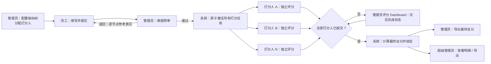
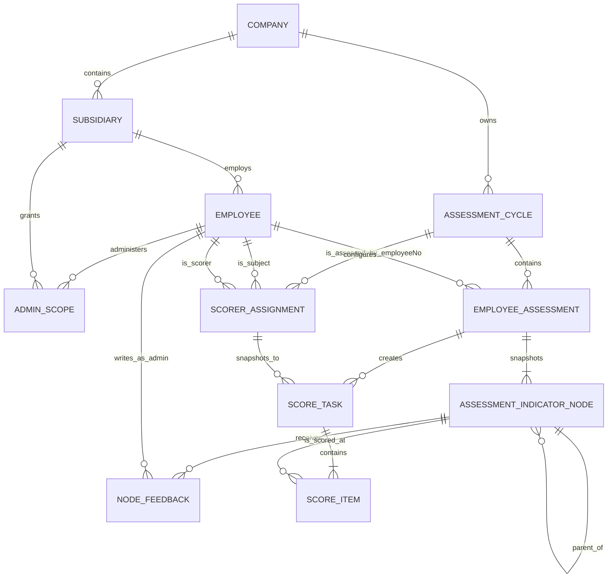

# Spec：企业员工考核指标与评分系统

## 1. 文档信息

| 项目 | 内容 |
| --- | --- |
| 产品名称 | 企业员工考核指标与评分系统（以下简称“系统”） |
| 文档状态 | 需求规格草案 v0.3（待业务确认） |
| 面向对象 | 产品、UI/UX、前端、后端、测试与实施人员 |
| 核心目标 | 将员工名单、树状指标制定、员工填报、管理员预审、多打分人评分和分级导出统一到一个可审计、适配移动端的系统中。 |

## 2. 背景与目标

企业需要按子公司对员工设定考核指标，并在一个考核周期内完成员工自填、管理员预审、多个打分人独立评分与结果汇总。当前手工表格方式容易出现名单版本不一致、指标漏配、数据回收困难、权限越界和评分依据不清等问题。

系统以“人员能力可叠加”而非互斥角色设计：超级管理员负责全局组织与管理员授权；管理员负责本子公司的人员、打分人关系、树状指标配置、员工填报预审与汇总；员工负责个人指标填报；打分人负责对被分配员工独立评分。一个人可以同时是管理员、员工和打分人，且一个员工可有多名打分人。所有人员均以工号作为主键。系统必须支持 Excel 的名单、打分关系和指标批量导入，以及分级导出。移动端是正式使用场景，员工填写、打分人与管理员操作不应依赖电脑。

### 2.1 产品目标

1. 让超级管理员能在全局范围内配置组织和管理员。
2. 让管理员能在授权子公司内批量维护人员和指标，且不可访问其他子公司数据。
3. 让员工可在移动端快速完成个人指标填报，并保留草稿与提交状态。
4. 让管理员审核员工填报后才激活打分任务；让每名打分人按明确流程独立评分，自动得到可追溯的考核结果。
5. 让 Excel 成为标准化批量数据交换方式，并在导入失败时给出逐行错误。
6. 与企业微信、问券星的直接集成；可在后续迭代预留接口。

### 2.2 非目标（MVP 不包含）

- 薪酬、奖金发放、绩效面谈、晋升决策或人事档案全量管理。
- 复杂的多级 360 度互评、强制分布、校准会工作流。
- 原生 iOS/Android App；MVP 提供响应式 Web 和可安装的 PWA 能力即可。

### 2.3 已确认业务决策

| 决策 ID | 决策 |
| --- | --- |
| D-01 | 管理员负责人员、打分人、指标树、员工填报预审和汇总；管理员不参与评分。 |
| D-02 | 打分人由管理员显式分配，不以直属领导关系推断；一个员工可有多个打分人。 |
| D-03 | 所有人员使用工号 `employeeNo` 作为人员主键和人员关联外键。 |
| D-04 | 指标使用任意深度的树结构，根节点满分固定为 100；发布仅校验树分值结构。 |
| D-05 | 仅在管理员预审通过员工填报后，系统才向打分人激活评分任务。 |
| D-06 | 管理员只能看到打分任务完成状态；全员评分完成后仅能导出最终总分。超级管理员可看和导出全部细则。 |

## 3. 范围与模块地图

| 模块 ID | 职责 | 依赖 |
| --- | --- | --- |
| `organization-access` | 组织、账号、角色与数据权限 | — |
| `personnel-directory` | 人员名单维护及 Excel 导入/导出 | `organization-access` |
| `indicator-management` | 指标库、模板、人员指标配置与员工填报 | `organization-access`, `personnel-directory` |
| `assessment-scoring` | 考核周期、自评、管理员预审、多打分人评分、状态流转和总分计算 | `indicator-management` |
| `reporting-exchange` | 结果查询、统计、Excel 导出和导入记录 | `assessment-scoring` |
| `mobile-experience` | 移动端导航、填报、评分和结果查看标准 | 贯穿全部模块 |

建议交付顺序：`organization-access` → `personnel-directory` → `indicator-management` → `assessment-scoring` → `reporting-exchange`；每一模块均按本 Spec 的移动端要求验收。

## 4. 用户、角色与权限

### 4.1 角色定义

| 角色 | 用户范围 | 主要权限 |
| --- | --- | --- |
| 超级管理员 | 集团级系统管理员 | 管理组织、管理员账号、全局考核周期；查看与导出全量数据；处理导入任务。 |
| 管理员 | 被授权到一个或多个子公司，且同时保有员工身份 | 维护本范围人员、打分人分配和指标树；审核员工提交的指标填报并通过或退回；查看填报/打分完成状态；在全部评分完成后导出仅含最终总分的结果。管理员不得查看或修改任一打分明细。 |
| 员工 | 归属一个子公司 | 查看和填写本人指标、提交自评、查看本人当前周期结果及历史结果（按配置开放）。 |
| 打分人 | 被管理员分配为至少一名员工的评分人；可与管理员身份重叠 | 仅查看分配给自己的员工及已获管理员通过的指标快照，逐项录入得分和评语，独立提交评分。一个员工可有多名打分人。 |

### 4.2 权限原则

- 一个账号可同时拥有多个能力：`employee`（所有在职人员）、`indicator-admin`（经授权的管理员）、`scorer`（由管理员的打分分配自动获得）、`super-admin`。能力可叠加，不互斥。
- 所有人员记录及其业务外键使用不可变的工号 `employeeNo`；不使用内部自增人员 ID 作为人员主键。工号一经启用不得修改，人员停用后保留历史引用。
- 数据范围以“用户被授权的子公司”及“打分人—被打分员工分配”为基础；默认不跨公司访问。
- 超级管理员拥有全量数据权限，但普通管理员之间互相隔离。
- 员工只能读取和修改自己的数据，不能修改已锁定或已完成周期中的内容。
- 打分人只可访问被分配员工的、状态为“待评分”的指标快照和评分任务；不能查看未获预审通过、未分配或已撤销分配的员工数据。
- 管理员只可审核员工填报与管理流程，不得读取、导出、编辑任一打分明细、单个打分人分数或打分评语；管理员仅可查看“已打分 / 未打分”完成状态。
- 管理员进入“管理端”处理人员、打分人、指标、填报审核、汇总和导入导出；同一账号进入“员工端”处理本人自评，若其有打分任务则在员工端的“打分任务”中处理评分。系统必须提供显式的“管理端 / 员工端”身份视图切换，切换不改变登录会话。
- 所有创建、修改、删除、导入、提交、退回、评分、导出动作都必须记录操作日志：操作者、时间、对象、变更前后值、来源 IP/设备信息（若系统具备）。
- 后端接口必须二次校验数据范围，不能只依赖前端页面隐藏按钮。

## 5. 核心业务对象与数据规则

### 5.1 组织与人员

- 一个企业下有多个子公司；MVP 组织层级固定为“企业 → 子公司”，不支持无限级部门树。
- 员工必须归属一个子公司，且工号在同一企业内唯一并作为人员主键。
- 人员状态：`在职`、`停用`。停用人员不可登录或进入新的考核周期，但历史数据保留。
- 人员主键为 `employeeNo`（工号）；一个登录账号对应一个人员记录。管理员必须关联人员记录，因此也必须进入考核并具有个人指标。
- “打分人”是显式的多对多关系，而不是组织直属关系。一个员工可分配多名打分人；一名打分人可负责多名员工；同一员工不得成为自己的打分人。
- 打分关系包含生效范围和状态。修改、撤销或停用打分关系前，系统须列出受影响的在途评分任务；已被激活的评分任务保留打分人快照，避免任务被静默转移。

推荐人员字段：工号、姓名、手机号/登录账号、邮箱（可选）、子公司、岗位、在职状态、入职日期（可选）。打分人关系不存放于人员单行字段，而由独立关系表维护。

### 5.2 考核周期

考核周期是所有指标和评分数据的容器。字段包括：周期名称、开始日期、结束日期、填报截止时间、评分截止时间、适用子公司、状态、创建人。

| 周期状态 | 含义 | 可执行操作 |
| --- | --- | --- |
| 草稿 | 管理员可配置人员、打分人和指标树，员工不可填报 | 编辑、发布、作废 |
| 进行中 | 员工考核单可在填报、预审或评分状态间流转 | 催办、查看汇总、结束周期 |
| 已结束 | 不再接受新的员工填报或评分；用于处理异常或等待管理员决定 | 发布结果、重开（超级管理员）、归档 |
| 已发布 | 最终结果对企业规则允许的对象可见 | 导出、归档 |
| 已归档 | 只读历史记录 | 导出 |
| 已作废 | 不参与统计，保留审计信息 | 只读 |

系统在到达截止时间时自动提示管理员，但不自动强制切换状态；有权限的管理员/超级管理员需显式执行周期状态转换，以避免数据意外锁定。

### 5.2.1 员工考核单状态

| 考核单状态 | 含义 | 可执行操作 |
| --- | --- | --- |
| 未开始 / 填报中 | 员工尚未提交或正在保存草稿 | 填写、保存、提交 |
| 管理员预审中 | 员工已提交，等待管理员审核填报完整性 | 管理员通过或逐节点退回 |
| 已退回 | 管理员已附加节点参考意见，等待员工重新提交 | 修改、重新提交 |
| 评分中 | 管理员预审通过，所有打分任务已激活 | 打分人保存、提交评分 |
| 评分完成 | 该员工全部打分任务已提交，最终总分已锁定 | 按权限查看、导出 |
| 已作废 | 员工不参与本周期统计 | 只读 |

### 5.3 指标树、模板与个人考核项

指标采用任意深度的树状结构，而非固定的两级“指标 + 权重”表。每个节点包含：名称、描述/参考意见、目标值/目标描述（可选）、员工填报要求、附件要求、分值、排序、父节点和状态。

- 根节点代表一份员工在一个周期内的指标方案，根节点总分固定为 100 分。
- 节点可同时拥有描述和任意数量子节点；无子节点的叶子节点为可评分项。员工按配置在节点或叶子节点填写完成情况；打分人仅在叶子节点打分。
- 管理员可创建可复用的“指标树模板”，也可按员工直接建立/复制/编辑指标树；在发布前可自由调整层级、名称、描述、叶子项和分值。
- 校验规则仅约束分值结构：根节点分值必须为 100；每个非叶子节点的直接子节点分值之和必须等于该父节点分值；每个叶子节点分值必须大于 0。不得发布不满足上述规则的树。
- 个人指标树是“周期 + 员工”的不可变版本快照。模板或指标树后续变更不会回写已发布或已被员工填写的版本。
- 每名打分人对同一员工的叶子项满分总和为 100 分，实际得分可为 0–100 分。多个打分人的最终总分默认按算术平均计算并保留两位小数；若企业需指定打分人权重，作为后续扩展，权重合计仍须为 100。

## 6. 关键业务流程

### 6.1 初始化与管理员授权

1. 超级管理员创建企业和子公司，或从 Excel 导入子公司与人员名单。
2. 超级管理员创建/邀请管理员账号，并为每名管理员分配一个或多个子公司。
3. 管理员首次登录后仅能看见授权子公司及其人员。

验收：管理员尝试通过 URL、接口参数或导出操作访问未授权子公司数据时，系统返回无权限且不泄露数据。

### 6.2 管理员配置指标

1. 管理员创建考核周期（或在超级管理员创建的全局周期下进入本公司配置）。
2. 管理员选择人员，使用已有指标树模板批量分配，或导入个人指标树和打分人关系。
3. 系统校验人员、树结构、根节点 100 分、每层子项分值合计、打分人分配和周期状态。
4. 管理员查看“未配置指标树”或“未分配打分人”清单，补齐所有应考核人员后发布周期。

验收：发布时任何适用人员缺少指标树、打分人或任一节点分值校验失败，系统必须阻止发布并列明人员、节点路径与原因。

### 6.3 员工填报与自评

1. 员工登录后默认看到“待我处理”的当前周期及填报截止日期。
2. 员工逐项填写完成情况、完成值/说明和佐证附件（若该项要求）。
3. 员工可保存草稿；提交前系统校验必填项。
4. 提交后考核单进入“管理员预审中”；管理员按指标节点核验填报内容，并可针对任一节点填写参考意见后退回员工补充。

验收：草稿和未通过预审的考核单不会向任何打分人展示；员工提交后不能自行编辑，除非管理员退回或周期重新开放。

### 6.4 管理员预审、多人评分与结果发布

1. 管理员在“待预审”列表查看员工填报，按指标节点标记通过或退回，并可为每一条指标附加参考意见；退回必须填写至少一条节点意见。
2. 管理员通过预审后，系统基于该员工的打分人分配和指标树版本创建评分任务，并原子地将所有任务激活；任一任务激活失败时不得部分激活。
3. 打分人在“打分任务”列表仅看到分配给自己的、状态为“评分中”的员工；按已保存的指标树逐叶子项评分并填写评语，可保存草稿或提交。
4. 每名打分人提交时系统校验每个叶子项得分在 `0–该叶子项满分` 范围内；系统实时显示累计得分和 `/ 100`，提交后该打分任务锁定，打分人不得自行修改。
5. 当该员工所有激活打分任务均已提交时，系统在事务中计算最终总分、锁定考核单并标记为“评分完成”。管理员只能看到“哪些打分人已提交 / 未提交”，不得读取其分数或评语。
6. 当管理员权限范围内全部考核单均为“评分完成”时，管理员可导出仅含员工信息和最终总分的 Excel；任一未完成时系统禁止导出最终结果。
7. 超级管理员可随时查看全量打分明细、各企业完成情况与最终结果，并按权限导出明细或汇总。

验收：管理员无法通过界面或接口读取、导出或写入打分明细。已提交的打分任务不可静默修改；若需要重开，超级管理员须记录原因、撤销全部相关提交并重新激活受影响任务。

### 6.5 角色流程图



## 7. 功能需求

### 7.1 账号与访问（FR-01）

- 支持账号密码登录、退出、首次登录改密、忘记密码/管理员重置密码。
- 登录后默认进入员工端首页；具有管理员能力的用户可切换至管理端，超级管理员可切换至全局管理端。具有活跃打分任务的员工端显示“打分任务”入口。
- 密码至少 8 位，包含字母和数字；连续失败次数和会话时长由部署配置控制。
- 管理员账号创建后，可通过短信或邮箱发放激活链接；MVP 环境未接入消息服务时，超级管理员可生成一次性初始密码。

### 7.2 超级管理员工作台（FR-02）

- 展示企业级 Dashboard：企业/子公司数量、应考核人数、已填报人数、待预审人数、评分完成人数、未完成评分任务数和各子公司完成率；支持按企业、子公司和周期下钻。
- 管理子公司：新增、编辑、停用、查询；停用前校验是否有进行中周期。
- 管理管理员：创建、编辑、停用、重置密码、分配子公司、查看授权范围；管理员创建时必须关联现有或新建员工记录。
- 创建并管理全局考核周期；查看各子公司配置、填报进度、打分任务完成情况和最终分数分布。
- 可查看全部指标树、自评、打分明细和评语；可全局导入、导出、审计日志查询。

### 7.3 管理员工作台与汇总（FR-03）

- **填报 Dashboard** 必须显示本授权范围、所选周期内的：总人数、已填报人数、未填报人数；其中“已填报”指员工已提交且未被退回，“未填报”包含草稿、未开始和被退回待补充。
- 填报 Dashboard 的人员列表展示工号、姓名、指标树完成度、状态、最后更新日期和“催填报 / 审核 / 退回”操作。管理员可针对具体指标节点填写参考意见并退回本人；催办默认产生站内通知并记录发送时间。
- **评分 Dashboard** 必须显示本授权范围、所选周期内的：待评分人员数、全部打分人均已提交人数、存在未提交打分人数量；按员工仅展示打分人姓名/工号及“已提交 / 未提交”状态，严禁展示分数、评语、单个打分人总分或最终总分。
- 当评分 Dashboard 显示所有人员全部完成后，管理员显示“导出最终结果”操作；导出文件仅包含工号、姓名、子公司、周期、最终总分和完成时间，不含任何评分细则。
- 支持按子公司（多公司管理员）、周期、人员状态、完成状态和关键词筛选。
- 支持人员单个维护及批量 Excel 导入/导出。
- 支持指标树模板管理、批量配置、复制上一周期配置、打分人批量分配、查看未配置人员。
- 支持待预审列表、节点级审核意见、通过/退回及批量催办；管理员不提供分数查看或编辑入口。
- 支持导出人员名单、指标树、未完成名单、最终结果（满足全员完成门槛后）和导入错误报告。

### 7.4 员工端与打分任务（FR-04）

- 首页显示当前考核任务卡片：周期、截止日期、完成百分比、当前状态、主操作按钮。
- 指标详情按树状层级展示名称、描述、目标、员工填报区、附件、管理员节点参考意见和得分（按周期状态控制显示）。
- 具备保存草稿、提交、查看退回原因、再次提交、查看历史结果功能。
- 明确显示自动保存/保存成功、未保存改动、提交成功和逾期等状态，避免移动端误操作。
- 当当前员工拥有活跃打分任务时，员工端展示“打分任务”入口；该入口仅列出被分配员工，按已保存的指标树评分，支持暂存和提交，不提供越权人员搜索或退回员工的能力。

### 7.5 搜索、筛选与审计（FR-05）

- 管理端列表支持姓名、工号、手机号搜索，支持周期、子公司、状态筛选。
- 支持分页和服务端排序；导出必须按照当前筛选范围生成。
- 审计日志支持按时间、操作者、动作类型、对象类型、对象标识筛选；仅超级管理员可查看全量日志。

## 8. Excel 导入与导出（FR-06）

### 8.1 共同规则

- 管理端提供下载模板；模板首行固定字段名，字段说明和示例置于独立“说明”工作表。
- 支持 `.xlsx`，单次导入上限建议 5,000 行、10 MB；超出限制须在上传前提示。
- 上传后先执行预校验并展示“有效行数 / 错误行数 / 警告行数”；用户确认后才写入数据。
- 错误报告可下载为 Excel，至少包含原始行号、原始值、错误字段、错误原因。
- 整个文件采用原子导入：存在错误时默认不写入任何记录；可后续配置为“跳过错误行”模式，但 MVP 不开启。
- 每次导入保存任务记录：文件名、提交人、时间、类型、结果、错误报告、影响记录数。

### 8.2 人员名单导入

必填列：`工号`、`姓名`、`手机号/登录账号`、`子公司名称`、`在职状态`。

- 同一文件内工号不可重复；工号为人员主键，不允许更新。
- 子公司必须已存在；不存在时提示先创建或由超级管理员使用组织导入模板。
- 工号已存在时，要求用户选择“仅新增”或“按工号更新非主键字段”；默认仅新增，防止误覆盖。
- 导入不能改变其他管理员的授权范围。

### 8.3 打分人关系导入

必填列：`被打分人工号`、`打分人工号`、`周期名称`；可选列：`状态`、`备注`。

- 同一周期内的 `(被打分人工号, 打分人工号)` 组合不可重复，且两者不得相同。
- 两个工号均须对应在职员工并处于管理员授权的数据范围；不符合时整份文件预校验失败。
- 管理员只能在周期为草稿时批量增删打分关系；评分任务激活后变更关系不影响现有任务，需要由超级管理员执行受控重开。

### 8.4 指标树配置导入

必填列：`周期名称`、`工号`、`节点编码`、`父节点编码`、`节点名称`、`节点描述`、`分值`、`排序`。根节点的父节点编码为空且分值必须为 100。

- 只允许导入草稿状态的周期。
- 同一周期、同一员工的节点编码不可重复；父节点必须在同一员工、同一周期的导入文件中存在，不允许循环引用。
- 系统校验每个节点的子节点分值合计等于父节点分值，且根节点分值为 100。
- 管理员只能导入授权范围内人员。

### 8.5 导出

| 导出类型 | 内容 | 权限 |
| --- | --- | --- |
| 人员名单 | 人员基础信息、状态、所属子公司 | 超级管理员；管理员限授权范围 |
| 打分人关系 | 周期、被打分人工号、打分人工号、状态 | 超级管理员；管理员限授权范围 |
| 指标树配置 | 周期、工号、节点编码、父节点编码、名称、描述、分值 | 超级管理员；管理员限授权范围 |
| 评分明细 | 自评、节点得分、打分评语、打分人、最终计算过程 | 仅超级管理员 |
| 最终结果 | 工号、姓名、子公司、周期、最终总分、完成时间 | 超级管理员；管理员须本范围全部评分完成后限授权范围 |
| 未完成名单 | 未填报/待预审/待评分人员及截止时间 | 超级管理员；管理员限授权范围 |

导出文件名称应包含导出类型、周期、数据范围和生成时间。超过同步导出阈值（建议 10,000 行）时，采用后台生成，完成后在站内通知下载。

## 9. UI/UX 规格：移动端优先（NFR-UX）

### 9.1 总体原则

- 以 360–430 px 宽度手机屏幕为第一优先级，桌面端再扩展为双栏/表格视图。
- 关键操作（保存草稿、提交、打分人开始评分、管理员开始预审）必须在首屏或固定底部操作栏可见；触控目标不小于 44 × 44 px。
- 不通过颜色单独表达状态；必须配合文字、图标或标签。
- 所有表单提供明确标签、必填标识、行内错误和可读的成功反馈。
- 移动端避免横向滚动的大表格。人员和评分列表采用卡片式摘要，点击进入详情；仅导出和桌面管理页可使用完整表格。

### 9.2 信息架构

| 角色 | 移动端底部导航 | 桌面端主导航 |
| --- | --- | --- |
| 员工/打分人 | 首页、我的考核、打分任务（有任务时）、我的 | 侧边栏：首页、我的考核、打分任务（有任务时）、历史结果、个人设置 |
| 管理员 | 填报、评分、人员、我的 | 侧边栏：填报 Dashboard、评分 Dashboard、人员、指标树、打分人、导入导出、设置；顶部提供“切换到员工端” |
| 超级管理员 | 工作台、组织、周期、我的 | 侧边栏：工作台、组织与管理员、考核周期、数据中心、审计日志、设置 |

### 9.3 核心页面要求

**员工首页**：以“当前待办”为最高优先级，显示一个主要任务卡片和进度环；没有任务时展示空状态及下一步说明。

**员工指标填报页**：每项指标为可折叠卡片，卡片头部固定展示指标名称、权重和填写状态；展开后展示目标、输入控件、附件和历史退回意见。底部固定“保存草稿”和“提交”操作。提交前给出缺失项汇总。

**管理员填报 Dashboard**：首屏固定展示“总人数 / 已填报 / 未填报”三个数值及当前周期。下方是按未填报优先排序的人员清单，支持催填报；对已提交人员可打开树状填报审核页，在每一个指标节点写入参考意见并退回。页面不得显示任何评分数据。

**管理员评分 Dashboard**：展示人员的打分任务完成矩阵，例如“张三：2/3 名打分人已提交”；只能显示打分人身份与提交状态。全员完成前，“导出最终结果”不可用，并说明未完成数量；页面不得展示得分、评语、排名或最终总分。

**打分人评分页**：顶部显示被打分员工、周期和整体进度；按已保存的指标树逐叶子节点评分，得分输入控件必须显示合法范围；底部固定显示“当前合计 / 100 分”、暂存和提交。提交前校验每个叶子项均已评分，不提供管理员审核入口。

**人员/指标管理页**：手机端使用搜索 + 筛选抽屉 + 卡片列表；批量操作收纳于“更多”菜单，上传 Excel 前展示模板下载链接及字段说明。

### 9.4 响应式断点

- `≤ 767px`：单列布局、底部导航、卡片列表、固定底部操作栏。
- `768–1199px`：平板双栏或紧凑侧栏，表格可横向滚动但要固定关键列。
- `≥ 1200px`：完整侧边栏、数据表格、批量操作工具栏和详情抽屉。

### 9.5 无障碍与性能

- 关键流程达到 WCAG 2.1 AA：键盘可操作、可见焦点、文本与背景对比度不低于 4.5:1、表单错误可由读屏识别。
- 在 4G 网络和中端移动设备上，员工首页与指标详情首次可交互时间目标小于 3 秒；提交操作必须提供加载与重复提交保护。
- 断网或网络不稳定时，已输入但未提交的数据应保留在本地草稿并提示用户恢复；最终提交仅在服务端确认成功后显示完成状态。

## 10. 技术选型与低成本部署约束

仓库当前仅有 README，尚无 `package.json` 或既定版本。本节是绿地项目的确定性推荐：初始化时安装当期稳定版并提交锁文件；运行时选择 Node.js 22 或更高 LTS。MVP 不采用微服务、Redis、Kubernetes 或商业低代码平台，避免为小规模内部系统增加常驻成本和运维面。

### 10.1 应用与库

| 层级 | 选择 | 关键库/组件 | 采用原因 |
| --- | --- | --- | --- |
| 全栈 Web | Next.js App Router + TypeScript | `next`、`react`、`react-dom` | 一套 Node.js 进程同时提供响应式 Web、服务端页面和 REST API，适合员工移动端与管理后台共用领域逻辑。 |
| UI 基础 | Tailwind CSS + shadcn/ui + Lucide | `tailwindcss`、`shadcn`、`lucide-react` | 组件代码留在仓库而非引入重型运行时 UI 框架，便于按移动端规范修改。采用 Button、Sheet、Dialog、Tabs、Select、Combobox、Table、Pagination、Toast、Skeleton。 |
| 表单与校验 | React Hook Form + Zod | `react-hook-form`、`zod`、`@hookform/resolvers` | 指标树、节点反馈和批量导入都需要复杂表单；Zod 规则同时用于客户端提示和服务端输入验证。 |
| 指标树编辑 | dnd-kit + 自研树组件 | `@dnd-kit/react`、`@dnd-kit/helpers` | 使用可访问的拖拽/排序能力实现 `IndicatorTreeEditor`，但树结构、100 分校验和节点规则归系统自身控制。 |
| 数据表格 | TanStack Table | `@tanstack/react-table` | 管理端的人员、填报、打分完成矩阵需要服务端分页、筛选、排序与列配置；该库是 headless，能复用 shadcn/ui 的移动端表格/卡片表现。 |
| 图表 | Recharts | `recharts` | 仅用于超级管理员企业完成率、趋势和分数分布；普通管理员 Dashboard 优先使用数字卡与清单，不引入复杂 BI。 |
| 数据库 | PostgreSQL + Drizzle ORM | `pg`、`drizzle-orm`、`drizzle-kit` | PostgreSQL 承担主数据、审计、事务和并发锁；Drizzle 保留 SQL 级事务与约束能力，适合本 Spec 的评分锁定流程。 |
| 后台任务 | pg-boss | `pg-boss` | 导入、导出、催办、备份使用 PostgreSQL 驱动的队列，不单独部署 Redis。 |
| Excel | ExcelJS | `exceljs` | 在 Worker 中生成/解析 `.xlsx` 模板、错误报告和最终结果；5,000 行规模在受控任务内处理。 |
| 文件存储 | 阿里云 OSS | `ali-oss` | Excel、附件、错误报告和数据库备份放入私有 Bucket，不占用 ECS 应用磁盘；通过 RAM 角色/STS 和短期签名 URL 访问。 |
| 身份认证 | Cookie 会话 + Argon2id | `argon2`、`jose` | 不引入独立认证服务。密码安全哈希，服务端签发 HttpOnly、Secure、SameSite 会话 Cookie；权限始终由 API 层读取工号和授权范围判定。 |
| PWA 与草稿 | Serwist + IndexedDB | `@serwist/next`、`serwist`、浏览器 IndexedDB | 只缓存应用壳与静态资源；不缓存考核详情、分数或附件响应。未提交草稿仅在本设备 IndexedDB 暂存并加过期策略。 |

### 10.2 必建业务组件

| 组件 | 责任 |
| --- | --- |
| `RoleSwitcher` / `AppShell` | 管理端、员工端、超级管理员端切换与导航；不通过前端隐藏替代权限控制。 |
| `IndicatorTreeEditor` | 新建、缩进、排序、复制、删除指标节点，并实时显示各父节点的分值合计和根节点 `/ 100`。 |
| `IndicatorSubmissionForm` | 员工按指标树填写完成情况、上传附件、保存本地/服务端草稿、提交。 |
| `NodeFeedbackPanel` | 管理员逐节点通过或填写参考意见退回；仅处理填报内容。 |
| `ScorerAssignmentManager` | 管理员按工号为员工批量分配多个打分人，并显示配置校验。 |
| `ScorerTaskForm` | 打分人按冻结的指标树给叶子项打分、保存草稿并一次性提交。 |
| `SubmissionDashboard` | 管理员显示总人数、已填报、未填报、催办和预审入口。 |
| `ScoringProgressDashboard` | 管理员显示每个员工的打分人提交矩阵；严格不接收或渲染分数和评语字段。 |
| `EnterpriseDashboard` | 超级管理员显示各企业/子公司的填报、评分、分数分布和异常情况。 |
| `ImportWizard` / `ExportCenter` | 模板下载、预校验、错误文件、后台任务进度与按权限导出。 |

### 10.3 阿里云低成本部署拓扑

MVP 的最低生产基线是一台 2 vCPU / 4 GiB 内存、60 GiB ESSD 的阿里云 ECS（Linux）运行 Docker Compose；若导入导出频繁或并发增加，再升级为 4 vCPU / 8 GiB。该基线应先以压测结果校准，不把用户量承诺写死。

```text
Internet → Caddy（仅开放 80/443）
               └→ Next.js Web/API 容器
               └→ Node Worker 容器（pg-boss）
                          ↓
                    PostgreSQL 容器（仅内网）
                          ↓
                阿里云 OSS 私有 Bucket（文件/备份）
```

- Compose 管理 `caddy`、`web`、`worker`、`postgres` 四个服务；仅 Caddy 暴露公网端口，PostgreSQL 不开放安全组端口。
- Next.js 启用 `output: "standalone"` 构建精简运行镜像；Caddy 反向代理并自动续期 HTTPS 证书。 
- Postgres 数据、Caddy 证书数据使用命名卷；每天执行 `pg_dump` 并连同 OSS 文件清单上传至私有 OSS。恢复演练在上线前完成一次。
- 阿里云安全组仅放通 `80/443`；SSH 限制为固定运维 IP 或使用堡垒机。OSS 使用最小权限 RAM 角色或 STS，禁止在浏览器和仓库中出现长期 AccessKey。
- 在规模扩大前不拆分服务；若单机 PostgreSQL 成为瓶颈，第一步迁移到阿里云 RDS PostgreSQL，Web/Worker/OSS 接口不变。

### 10.4 选型依据（官方文档）

- Next.js 的自托管指南建议在应用前使用反向代理；其 `standalone` 输出可产生仅包含必需运行文件的部署目录：[自托管](https://nextjs.org/docs/app/guides/self-hosting)、[`output: "standalone"`](https://nextjs.org/docs/app/api-reference/config/next-config-js/output)。
- Drizzle 支持 PostgreSQL 驱动和可配置隔离级别的事务，适用于预审激活与最终锁分：[PostgreSQL](https://orm.drizzle.team/docs/get-started-postgresql)、[事务](https://orm.drizzle.team/docs/transactions)。
- pg-boss 以 PostgreSQL 为队列后端，可减少一个 Redis 服务的维护成本：[pg-boss](https://pgboss.io/introduction)。
- OSS 官方 Node.js SDK 为 `ali-oss`，并建议生产环境使用临时凭证/RAM 角色：[OSS Node.js SDK](https://help.aliyun.com/en/oss/developer-reference/nodejs-sdk/)。
- Docker Compose 用单一 YAML 管理多容器应用；Caddy 可自动签发、续期证书并重定向 HTTP 到 HTTPS：[Compose](https://docs.docker.com/compose/)、[Caddy 自动 HTTPS](https://caddyserver.com/docs/automatic-https)。
- shadcn/ui 的表格方案与 TanStack Table 配合；TanStack Table 是可自主控制标记的 headless 表格，适合桌面表格和移动卡片共用数据逻辑：[Data Table](https://ui.shadcn.com/docs/components/base/data-table)、[TanStack Table](https://tanstack.com/table/latest/docs/overview)。
- Serwist 提供 Next.js 的 PWA 配置；dnd-kit 提供 React 拖拽和排序能力；Zod 提供 TypeScript-first schema 校验：[Serwist](https://serwist.pages.dev/docs/next/getting-started)、[dnd-kit](https://dndkit.com/react/quickstart/)、[Zod](https://zod.dev/)。
- ExcelJS 是支持 workbook、`.xlsx` 读写和流式 writer 的开源实现；Recharts 以 React 组件组合图表；`argon2` 提供 Argon2id 哈希与校验：[ExcelJS](https://github.com/exceljs/exceljs)、[Recharts](https://recharts.github.io/en-US/)、[node-argon2](https://github.com/ranisalt/node-argon2)。

## 11. 建议的数据模型

| 实体 | 关键字段 | 说明 |
| --- | --- | --- |
| `Company` | id, name, status | 企业租户；MVP 可先部署为单企业，但模型保留租户边界。 |
| `Subsidiary` | id, companyId, name, code, status | 子公司。 |
| `Employee` | **employeeNo (PK)**, login, passwordHash, subsidiaryId, name, position, status | 人员和登录账户合一；所有人的业务主键均为工号。角色/能力通过关联关系授予，不能用单个互斥 `role` 字段表示。 |
| `AdminScope` | **adminEmployeeNo**, subsidiaryId | 管理员与子公司的多对多授权；`adminEmployeeNo` 外键指向 `Employee.employeeNo`。 |
| `AssessmentCycle` | id, companyId, name, dates, status | 考核周期。 |
| `IndicatorTemplate` | id, companyId, name, rootMaxScore | 指标树模板头；根分值固定为 100。 |
| `IndicatorTemplateNode` | id, templateId, parentNodeId, nodeCode, name, description, maxScore, sortOrder | 可任意嵌套的模板节点。 |
| `EmployeeAssessment` | id, cycleId, **employeeNo**, status, finalScore, version | 员工在周期内的考核单；`(cycleId, employeeNo)` 唯一。 |
| `AssessmentIndicatorNode` | id, assessmentId, parentNodeId, nodeCode, description, maxScore, selfContent | 发布后冻结的个人指标树快照。 |
| `NodeFeedback` | id, assessmentNodeId, adminEmployeeNo, feedback, status | 管理员对任一指标节点的通过/退回意见。 |
| `ScorerAssignment` | id, cycleId, **employeeNo**, **scorerEmployeeNo**, status | 管理员维护的多打分人关系；同一被打分人可有多个打分人。 |
| `ScoreTask` | id, assessmentId, scorerEmployeeNoSnapshot, status, totalScore, version | 管理员预审通过后创建的打分任务；打分人快照防止关系变更影响在途任务。 |
| `ScoreItem` | id, scoreTaskId, assessmentNodeId, score, comment | 打分人对叶子节点的得分与评语。 |
| `Attachment` | ownerType, ownerId, storageKey, name, size | 填报佐证附件。 |
| `ImportJob` / `ExportJob` | type, scope, status, fileKey, errorFileKey | 导入导出任务。 |
| `AuditLog` | actorId, action, entityType, entityId, before, after, createdAt | 不可修改的审计记录。 |

数据一致性约束：`Employee.employeeNo` 为企业内主键；`EmployeeAssessment` 在 `(cycleId, employeeNo)` 上唯一；`ScorerAssignment` 在 `(cycleId, employeeNo, scorerEmployeeNo)` 上唯一且 `employeeNo != scorerEmployeeNo`；`ScoreTask` 在 `(assessmentId, scorerEmployeeNoSnapshot)` 上唯一；创建打分任务时必须快照打分人；评分和状态转换必须在事务内处理。

### 11.1 数据关系图



## 12. 接口边界（概要）

接口应以 `/api/v1` 为前缀，所有列表接口支持分页、筛选和按数据权限自动收敛范围。至少覆盖：

- `POST /auth/login`、`POST /auth/logout`、`POST /auth/password/reset`
- `GET/POST/PATCH /subsidiaries`、`GET/POST/PATCH /admins`
- `GET/POST/PATCH /employees`、`POST /employees/import`、`GET /employees/export`
- `GET/POST/PATCH /cycles`、`POST /cycles/{id}/publish`、`POST /cycles/{id}/transition`
- `GET/POST/PATCH /indicator-templates`、`GET/POST/PATCH /indicator-templates/{id}/nodes`、`POST /assessments/batch-assign`
- `GET/POST/DELETE /scorer-assignments`、`POST /scorer-assignments/import`
- `GET/PATCH /my/assessments/{id}`、`POST /my/assessments/{id}/submit`
- `GET /admin/submissions`、`GET /admin/submissions/{id}`、`POST /admin/submissions/{id}/approve`、`POST /admin/submissions/{id}/return`
- `GET /scorer/tasks`、`GET/PATCH /scorer/tasks/{id}`、`POST /scorer/tasks/{id}/submit`
- `GET /admin/dashboards/submissions`、`GET /admin/dashboards/scoring`、`POST /admin/reminders`、`POST /admin/exports/final-results`
- `GET /super-admin/dashboards/enterprise`、`GET /super-admin/score-details`、`POST /super-admin/exports/score-details`
- `POST /imports`、`GET /imports/{id}`、`POST /exports`、`GET /exports/{id}`
- `GET /audit-logs`

所有写入接口返回资源标识、当前状态、更新时间和可展示的字段级校验错误。状态切换接口必须要求预期当前状态，以避免并发覆盖。

## 13. 安全、隐私与运维要求（NFR-SEC）

- 使用 HTTPS；密码不可明文保存或记录到日志；导出下载链接必须限时且按权限验证。
- 员工资料、考核内容、分数、附件均视为敏感企业数据；生产环境需最小权限访问、备份加密和访问审计。
- 上传文件只允许白名单类型，校验 MIME 类型与文件签名，限制大小；附件下载须鉴权。
- 关键数据执行每日备份，保留周期由企业制度确定；恢复演练至少每半年一次（建议）。
- 记录应用错误、导入失败、权限拒绝、长耗时导出和状态转换失败；不得将敏感内容写入普通错误日志。

### 13.1 并发与一致性要求（NFR-CONC）

- 所有可编辑聚合对象（员工考核单、指标树、打分任务）必须有单调递增的 `version` 字段。客户端的保存、提交、预审通过、退回和重开请求必须携带预期版本；版本不一致时返回 `409 Conflict` 和最新状态，不得采用“后写覆盖先写”。
- “管理员预审通过并激活打分任务”必须在单一数据库事务中执行：锁定考核单和当前有效打分分配，确认考核单仍处于预审中，再批量创建全部唯一打分任务并切换状态。任一步失败则整体回滚。
- “提交打分并计算最终分”必须在单一数据库事务中执行：锁定当前打分任务，校验打分人、状态和版本，写入明细、锁定任务；随后锁定对应考核单并统计未完成任务。仅当未完成数为 0 时计算最终总分并切换为评分完成。
- 所有提交类写操作必须支持 `Idempotency-Key`。相同调用方和键的重复请求返回第一次的结果，避免移动端弱网重试造成重复打分、重复催办或重复导出。
- 数据库必须设置唯一约束：`(cycleId, employeeNo)` 考核单唯一、`(cycleId, employeeNo, scorerEmployeeNo)` 打分分配唯一、`(assessmentId, scorerEmployeeNoSnapshot)` 打分任务唯一、`(scoreTaskId, assessmentNodeId)` 打分明细唯一。
- Excel 导入、导出、催办通过后台任务执行；任务状态机至少包括 `queued`、`running`、`succeeded`、`failed`。同一范围的“最终结果导出”在执行前再次检查全员评分完成，避免因并发提交产生越权或不完整文件。
- 管理员退回员工填报时，如员工正在保存草稿，系统保留草稿但禁止其提交旧版本；员工刷新后必须先阅读节点参考意见并基于最新版本重新提交。

## 14. 命令（项目初始化后）

技术栈确认前没有可执行项目命令。若采用第 10 节建议的 Next.js + TypeScript 工程，则统一使用：

```bash
# 本地开发
npm run dev

# 类型检查
npm run typecheck

# 代码检查
npm run lint

# 单元与集成测试
npm test -- --coverage

# 端到端测试
npm run test:e2e

# 生产构建
npm run build
```

## 15. 项目结构（建议）

```text
src/
  app/                 # 路由与页面
  components/          # 可复用 UI 组件（含移动端组件）
  features/            # 按业务模块组织的页面、状态和用例
  server/               # API、权限、领域服务、数据访问
  lib/                  # 校验、格式化、Excel 和通用工具
  styles/               # 主题和全局样式
tests/
  unit/                # 评分、校验和权限单元测试
  integration/         # API、数据库、导入导出集成测试
e2e/                   # 浏览器端到端测试，覆盖手机视口
docs/                  # 产品、接口、部署文档
SPEC-employee-assessment.md
```

## 16. 代码风格

- 使用 TypeScript 严格模式；领域对象和接口使用 PascalCase，变量/函数使用 camelCase，文件使用 kebab-case。
- 不绕过类型和校验：禁止未说明的 `any`、`@ts-ignore`、删除测试或仅前端鉴权。
- 后端业务逻辑通过领域服务集中实现；UI 组件不直接承担权限或评分计算规则。

```ts
type ScoreItem = {
  maxScore: number;
  score: number;
};

export function calculateScorerTotal(items: ScoreItem[]): number {
  const total = items.reduce((sum, item) => {
    if (item.score < 0 || item.score > item.maxScore) {
      throw new Error("Score is outside the indicator range");
    }

    return sum + item.score;
  }, 0);

  if (total > 100) throw new Error("Total exceeds 100 points");
  return total;
}
```

## 17. 测试策略

- 单元测试：指标树分值校验、叶子项评分范围、多人最终分平均计算、状态机、角色/数据范围规则、打分人关系校验、Excel 字段解析和错误定位。
- 集成测试：导入原子性、打分人快照、管理员不可读取/写入评分字段、打分人不得访问未分配员工、全员未完成时管理员导出拦截、跨子公司越权拦截、文件下载鉴权、并发状态转换。
- 端到端测试：超级管理员授权管理员、管理员导入人员/打分人关系和指标树、员工移动端自评、管理员节点级预审通过、多个打分人独立评分、全员完成后管理员导出最终总分这一完整路径；同时验证管理员切换员工端后可完成自己的自评或打分任务。
- 移动端回归：至少在 360×800、390×844 和 768×1024 视口运行核心流程；测试键盘遮挡、固定底栏、表单错误和弱网草稿恢复。
- 覆盖目标：领域服务和权限逻辑行覆盖率不低于 80%；所有 P0/P1 流程必须有端到端覆盖。

## 18. 边界

- **始终执行：** 服务端权限校验；输入校验；工号主键与打分人关系/快照校验；指标树根分值与子项分值校验；操作审计；导入预校验；移动端核心流程测试；提交前防重复；发布前指标树和打分人完整性校验。
- **须先确认：** 数据库结构重大变更；新增第三方依赖；外部消息/SSO/HRIS 集成；修改评分公式、角色体系或数据保留期限；启用跨公司管理员权限。
- **禁止执行：** 提交密钥或真实敏感数据；绕过权限检查；让管理员读取、导出或写入打分细则；允许打分人给未分配员工评分；直接修改已发布周期的历史评分；删除失败测试以获得通过；让导入失败时部分静默写入数据。

## 19. MVP 成功标准

1. 超级管理员可以创建至少两个子公司、创建管理员并分别授权，管理员不能互相读取数据；每个管理员均关联为员工且可在员工端看到自己的考核任务。
2. 管理员可通过 Excel 在授权范围内导入至少 5,000 名人员，所有人员以工号为主键；字段错误能生成逐行错误报告且不写入半成品数据。
3. 管理员可为选定人员批量配置任意层级的指标树和多个打分人；系统发布前强制校验每棵指标树根分值为 100、每层子项分值合计正确、每人至少有一名打分人，并定位异常节点路径。
4. 员工可在 390 px 宽度移动浏览器完成保存草稿、附件上传、提交，并接收包含逐节点参考意见的管理员退回后再次提交。
5. 管理员填报 Dashboard 准确显示总人数、已填报人数和未填报人数，支持针对人员催办和按指标节点退回；管理员预审通过前，任何打分人均无法访问评分任务。
6. 一个员工可有多个打分人；每个打分人只可在移动端给分配给自己的员工按已保存指标树评分。管理员只能看到每名打分人的已提交/未提交状态，无法通过任何界面或接口读取、导出或修改打分明细。
7. 任一评分任务未提交时，管理员不能导出最终结果；全员评分完成后，管理员仅可导出最终总分。超级管理员可查看和导出全量评分细则及各企业统计。
8. 对并发保存、预审、评分提交、催办和导出，系统通过版本校验、事务、唯一约束和幂等键避免重复写入或丢失更新。
9. 关键流程在目标移动设备和现代桌面浏览器上可用，且达到第 9.5 节的无障碍和性能目标。

## 20. 待确认的业务决策

1. 考核周期由超级管理员统一创建，还是允许管理员在各子公司独立创建？本 Spec 两种模式均可支持，但 MVP 应二选一。
2. 多打分人的最终总分是否采用默认的算术平均；若需要加权，权重由谁配置、是否允许不同周期不同权重？
3. 员工在结果发布后是否可见自己的逐节点得分、打分评语和管理员节点参考意见，还是只见最终总分？
4. 指标树仅需要分值型评分，还是需要定性等级项及其分值映射？
5. “全员完成后管理员才可导出”中的范围是其单个子公司、其全部授权子公司，还是整个企业周期？本 Spec 暂按“管理员全部授权范围”执行。
6. 是否需要按最终总分排名？若需要，排名范围（公司/子公司/岗位）和同分规则是什么？
7. 附件的类型、单文件大小、总大小以及保存期限是否受企业制度约束？
8. 登录方式是账号密码，还是必须接入企业微信、钉钉或单点登录？
9. 是否需要通知渠道（站内、短信、邮件、企业微信/钉钉）与催办频率控制？
10. 员工与考核数据的保存、归档和删除期限是什么？
